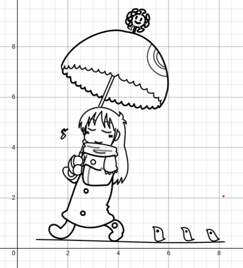
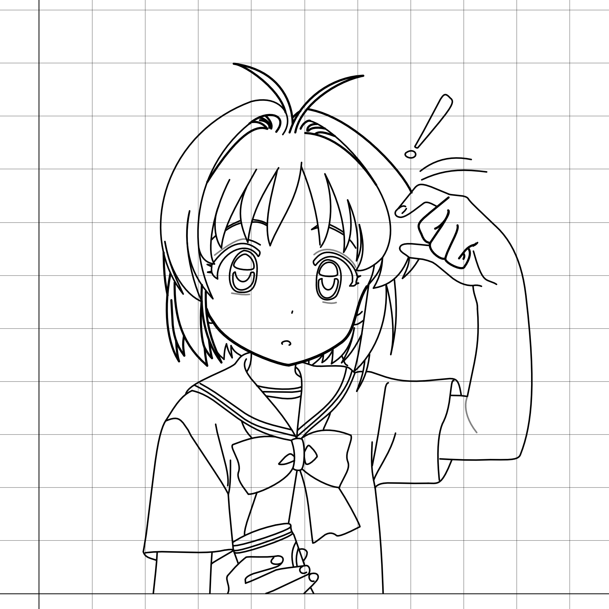

# desmos_draw_tool

Tool to make drawings in desmos with cubic bezier curves.

### Controls
- S: Set starting point for new lines.
- Q: Erase current line.
- D: Apply current line and draw a new one pointing to the cursor.

#
Note: an api key is needed from desmos.com
#

  
  

